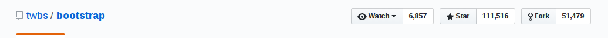

# UI库

对于攻城狮来说，掌握几大UI库那可真是非常有必要的，尤其是跟我一样特别注重设计美，但又败于自己捉襟见肘的设计能力。不过没关系，我有强大的库啊，哪里需要引哪里。

下面先给大家列举我所使用过的UI库，以后再发现好用的再补充:

1.阿里icon

官网：http://www.iconfont.cn/

>阿里巴巴体验团队倾力打造,设计和前端开发的便捷工具。国内功能很强大且图标内容很丰富的矢量图标库,提供矢量图标下载、在线存储、格式转换等功能。

阿里icon是我最早使用的矢量图标库,其实我们大多时候选用UI库时都是因为想要使用icon，保存成svg的直接引入比png/jpg的文件更小，而且在更改颜色的时候方便，而不是切换图片(如果你的页面里还能看得到图片，那也有点low)

优点：阿里icon库的图标确实够多，基本上你想要的都有，下载图标提供png,svg,AI格式，而且还提供代码下载，方便直接引入自己的html或者js里使用(按照下载后的代码demo来修改)

２．bootstrap

官网：http://getbootstrap.com/

中文：http://www.bootcss.com/

>Bootstrap是Twitter推出的一个用于前端开发的开源工具包。它由Twitter的设计师Mark Otto和Jacob Thornton合作开发,是一个CSS/HTML框架

这个库我相信10个攻城狮有7个听过，火不火看star,111516，目前最多的了

为啥这么多star，我觉得很大一部分的原因是它非常容易上手，语法是html,css简单的js，加上详细的文档让你可以快速的使用起来。

优点：bootstrap提供了响应式布局，栅格系统确实超级方便(实推)。bootstrap封装了非常多的组件，在没有UI支持时，选择它来构建你的页面不用头疼如何设计，统一设计规范，使开发效率更高。

缺点：一大堆的class我真是要眼晕，而且各种代码覆盖，代码洁癖简直要抓狂，如果要修改某些样式就要统一别的样式，也是一个大的工程。bootstrap风格好明显，基本上用它搭的网站一眼就可以看出来，没有自己的产品特色。

总结：人们往往倾向的不是美的好看的，而是看起来不丑的，因为这样可以确保自己不会出错。所以bootstrap会使你感觉很‘稳’。如果注重项目的功能实现，没有UI设计的支持时建议选用。当然要是想让你的产品令人眼前一亮，或许下面的库会让你更倾心。

3.Material-UI

官网：http://www.material-ui.com/#/

我第一次进入官方试了几个组件之后，真心感觉这种扁平风格好对我的胃口，就它了。当然也不要一个页面使用太多，不然也会审美疲劳。

后面会详细介绍

4.AntDesign

官网： https://ant.design/index-cn

> ANT DESIGN 是蚂蚁金服体验技术部出品的一个设计&前端框架,基于 React 框架

它的风格还有怎么美我就不多赘述了，[设计规范](https://ant.design/docs/spec/introduce-cn)里设计师都详细的说明了，UI与UE的结合，直截了当，完美的交互，而且基于我最熟悉的react框架，基本上是我项目中的首选库。

tips:中文API文档哦，很容易上手的。

目前：蚂蚁金服，阿里巴巴，口碑，美团，滴滴这几个巨头公司都在使用，有你的心仪公司么，反正有我的，所以快来用起来。
